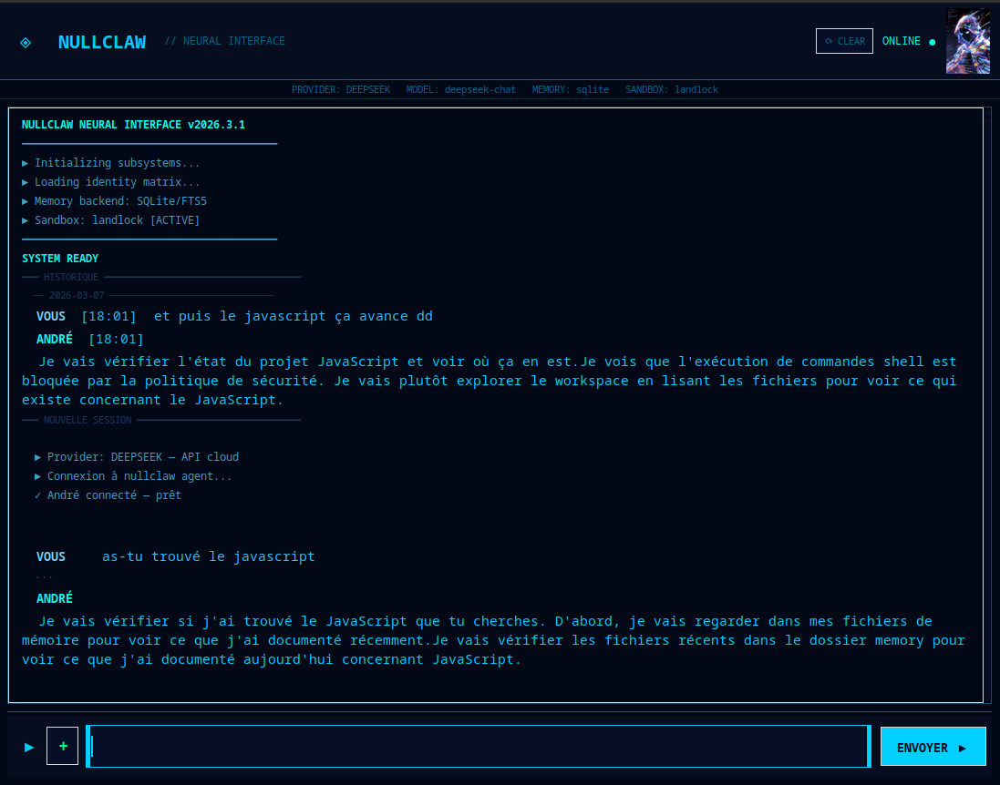

# ◈ nullclaw-neural-interface

> Interface graphique bleu néon futuriste pour [nullclaw](https://github.com/nullclaw/nullclaw) — un assistant IA autonome ultra-léger tourné 100% en local sur Linux.


---

## 📸 Aperçu




Interface terminal cyberpunk bleu néon avec :
- Séquence de boot animée
- **Avatar animé** de l'agent en haut à droite — s'anime quand il travaille
- Zone de chat avec **historique des conversations** rechargé au démarrage
- Barre de saisie avec glow effect
- Bouton `+` pour envoyer des fichiers dans `drops/`
- Provider et modèle affichés **automatiquement** depuis `config.json`
- Démarrage automatique d'Ollama **seulement si nécessaire** (pas avec Gemini, DeepSeek, etc.)

---

## 🧩 Prérequis

- Linux Debian / Devuan / Peppermint OS (x86_64)
- Python 3 + python3-tk + python3-pexpect + python3-pil + python3-pil.imagetk
- [Ollama](https://ollama.com) installé (optionnel — seulement pour modèles locaux ou cloud Ollama)
- nullclaw compilé (voir installation ci-dessous)
- Au moins **2 Go d'espace libre** et **4 Go de RAM**

---

## ⚙️ Installation complète — de A à Z

### Étape 1 — Installer Ollama (optionnel)

Ollama est nécessaire seulement si tu utilises un modèle local ou cloud via Ollama.
Si tu utilises Gemini, DeepSeek, Groq ou OpenRouter directement, tu peux sauter cette étape.

```bash
curl -fsSL https://ollama.com/install.sh | sh
```

Vérifie :

```bash
ollama --version
```

---

### Étape 2 — Choisir un provider et un modèle IA

nullclaw supporte 30+ providers. Voici les meilleures options gratuites ou peu coûteuses :

#### Providers cloud recommandés (sans Ollama)

| Provider | Modèle recommandé | Limite gratuite |
|----------|-------------------|-----------------|
| **Google Gemini** | gemini-2.5-flash | 1500 req/jour |
| **DeepSeek** | deepseek-chat | ~2€ pour des millions de tokens |
| **Groq** | llama-3.3-70b-versatile | 14 400 req/jour |
| **OpenRouter** | llama-3.3-70b | Tier gratuit |

#### Modèles locaux via Ollama (100% hors-ligne)

| RAM disponible | Modèle recommandé | Commande |
|----------------|-------------------|----------|
| < 2 Go | smollm:1.7b | `ollama pull smollm:1.7b` |
| 2-4 Go | gemma2:2b | `ollama pull gemma2:2b` |
| 2-4 Go | deepseek-coder:1.3b (code) | `ollama pull deepseek-coder:1.3b` |
| 4+ Go | kimi-k2.5:cloud (cloud gratuit) | `ollama pull kimi-k2.5:cloud` |

> ⚠️ Les modèles `:cloud` nécessitent une connexion internet. Les modèles locaux fonctionnent 100% hors-ligne.

---

### Étape 3 — Installer Zig 0.15.2

nullclaw est écrit en Zig. La façon la plus simple d'installer Zig sur Debian/Devuan est via pip :

```bash
# Crée un environnement virtuel Python
python3 -m venv ~/venv-zig
source ~/venv-zig/bin/activate

# Installe Zig
pip install ziglang==0.15.2

# Vérifie
python -m ziglang version
# Doit afficher : 0.15.2
```

> ⚠️ Zig 0.15.2 n'est pas disponible en téléchargement direct sur ziglang.org — la méthode pip est la seule qui fonctionne actuellement.

---

### Étape 4 — Cloner et compiler nullclaw

```bash
# Clone nullclaw (choisis ton dossier)
git clone https://github.com/nullclaw/nullclaw.git ~/nullclaw/app
cd ~/nullclaw/app

# Active l'environnement Zig si pas déjà fait
source ~/venv-zig/bin/activate

# Compile (2-5 minutes)
python -m ziglang build -Doptimize=ReleaseSmall

# Vérifie
./zig-out/bin/nullclaw --version
```

---

### Étape 5 — Configurer nullclaw (onboard)

```bash
cd ~/nullclaw/app
./zig-out/bin/nullclaw onboard --interactive
```

Réponses recommandées dans le wizard :

| Étape | Choix recommandé |
|-------|-----------------|
| Provider | Ton choix (Google Gemini, DeepSeek, Ollama...) |
| API Key | Ta clé API (ou Entrée si Ollama local) |
| Modèle | Le modèle de ton provider |
| Memory backend | `1` — SQLite (recommandé) |
| Tunnel | `1` — none |
| **Autonomy level** | **`2` — full** (recommandé pour coder) |
| Configure channels | `n` |
| Workspace path | `/home/TON_USER/nullclaw/workspace` |

---

### Étape 6 — Personnaliser l'identité (optionnel)

```bash
nano ~/nullclaw/workspace/IDENTITY.md
```

Exemple :

```markdown
# Identité

Tu es mon assistant personnel IA.
Tu parles français par défaut.
Tu es direct, efficace et honnête.
Tu m'aides avec le code, les tâches quotidiennes et les questions techniques.
Tu te souviens de mes préférences au fil du temps.
```

---

### Étape 7 — Installer les dépendances Python

```bash
sudo apt install python3 python3-tk python3-pexpect python3-pil python3-pil.imagetk
```

---

### Étape 8 — Installer nullclaw-neural-interface

Télécharge le `.deb` depuis les [Releases](../../releases) puis :

```bash
sudo dpkg -i nullclaw-ui_1.6.0_all.deb
```

---

### Étape 9 — Adapter les chemins

Par défaut, l'interface cherche nullclaw dans :

```
/media/pep00/Back Up/nullclaw/app/zig-out/bin/nullclaw
```

Si ton installation est ailleurs, modifie le fichier :

```bash
sudo nano /usr/share/nullclaw/nullclaw_app.py
```

Trouve et modifie ces deux lignes :

```python
NULLCLAW_DIR = "/ton/chemin/vers/nullclaw/app"
NULLCLAW_BIN = "/ton/chemin/vers/nullclaw/app/zig-out/bin/nullclaw"
DROPS_DIR    = "/ton/chemin/vers/nullclaw/workspace/drops"
```

---

## 🚀 Lancement

```bash
nullclaw-ui
```

Ou depuis le menu Applications de ton bureau.

---

## 🎨 Avatar de l'agent

L'interface affiche un avatar animé (GIF) de ton agent en haut à droite du header :
- **Animé** quand l'agent travaille sur ta question
- **Idle** (frame 1) quand il a répondu

Les fichiers avatar sont dans `/usr/share/nullclaw/` :
- `andre.gif` — animation
- `andre_static.png` — image statique

Pour personnaliser, remplace ces fichiers par tes propres images (même nom, taille recommandée : 64x95px).

---

## 💬 Historique des conversations

L'historique est sauvegardé dans `~/.nullclaw/ui_history.json` et rechargé automatiquement au démarrage avec dates et heures. Le bouton **⟳ CLEAR** en haut à droite efface l'historique affiché et sauvegardé.

---

## 📁 Dossier drops

L'interface inclut un bouton `+` pour envoyer des fichiers à nullclaw. Les fichiers sont copiés dans :

```
~/nullclaw/workspace/drops/
```

nullclaw peut ensuite les lire, les analyser ou les exécuter (selon ta config de sécurité).

---

## 🔒 Sécurité

La config de sécurité se trouve dans `~/.nullclaw/config.json`. Par défaut :

- **supervised** — nullclaw demande confirmation avant d'agir
- **workspace_only** — accès limité au dossier workspace
- **allowed_commands** — seulement `python3`, `ls`, `cat`, `pwd`

Pour autoriser l'exécution de scripts Python dans `drops/` :

```json
"allowed_commands": ["python3", "ls", "cat", "pwd"],
"allowed_paths": ["/ton/chemin/nullclaw/workspace"],
"require_approval_for_medium_risk": false
```

---

## 🖥️ Lanceur bureau (optionnel)

Pour lancer nullclaw-ui d'un double-clic :

```bash
nano ~/Desktop/nullclaw.desktop
```

```ini
[Desktop Entry]
Name=Nullclaw
Comment=Assistant IA local
Exec=nullclaw-ui
Icon=utilities-terminal
Terminal=false
Type=Application
Categories=Development;Utility;
```

```bash
chmod +x ~/Desktop/nullclaw.desktop
```

---

## 📦 Structure du projet

```
nullclaw-neural-interface/
├── nullclaw-ui_1.6.0_all.deb   # Package installable
├── André.png                    # Avatar statique
├── andre.gif                    # Avatar animé
├── screenshot.png               # Aperçu de l'interface
├── LICENSE                      # MIT
└── README.md                    # Ce fichier
```

---

## 📝 Changelog

| Version | Nouveautés |
|---------|-----------|
| **v1.6.0** | Avatar animé GIF — s'anime quand l'agent travaille |
| **v1.5.0** | Historique des conversations sauvegardé + bouton CLEAR |
| **v1.4.0** | Lit config.json automatiquement — provider/modèle dynamiques |
| **v1.3.0** | Bouton + pour envoyer des fichiers dans drops/ |
| **v1.2.0** | Parsing correct du output nullclaw via pexpect |
| **v1.1.0** | Intégration pexpect pour TTY virtuel |
| **v1.0.0** | Release initiale — interface bleu néon futuriste |

---

## 🤝 Crédits

- [nullclaw](https://github.com/nullclaw/nullclaw) — le moteur IA (MIT)
- [Ollama](https://ollama.com) — le runtime de modèles locaux
- Interface graphique par **Richer Rail**

---

## 📄 Licence

MIT — voir [LICENSE](LICENSE)

---

> **nullclaw-neural-interface** — Null overhead. Null compromise. Deploy anywhere.
